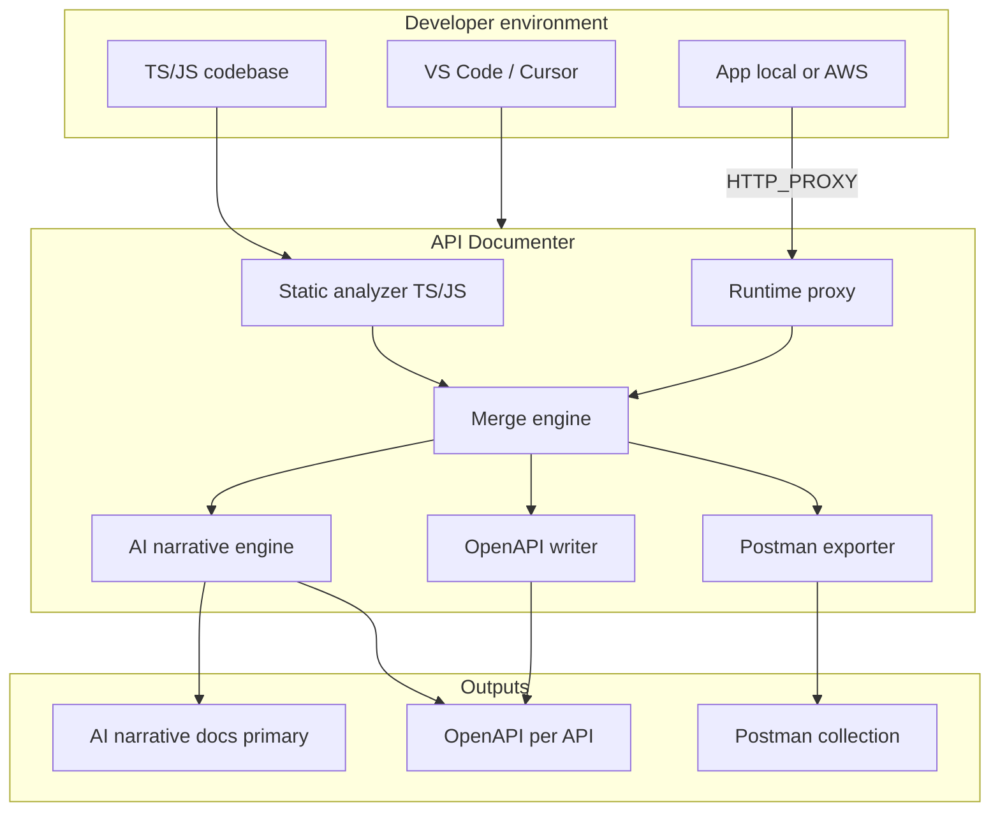

# API Documenter – Developer-First, AI-Augmented Docs

**Perspective**: Staff cloud/devops technical lead. Goal: reduce time developers spend on Postman setup and API docs by making **AI-generated narrative the center** of the tool—not optional. The primary deliverable is human-readable API documentation produced by AI from discovered and captured API data; OpenAPI and Postman support the workflow. Tool is robust, local-only, and trivial to adopt in VS Code/Cursor.

---

## Goal

- **For developers**: One place to get up-to-date, human-readable API docs and Postman-ready collections without manual setup. Works in local env; calls may be to local services or AWS.
- **Center of the tool: AI-generated narrative**. The main deliverable is human-readable API documentation (overview, per-endpoint descriptions, request/response summary, curl examples, how to test in Postman) produced by AI. Static analysis and runtime capture feed the AI; the AI runs by default (on update or on demand) and produces the narrative as the primary artifact. OpenAPI and Postman are generated in the same pipeline to support tooling and sharing.
- **Core pipeline**: TS/JS-focused. Discovers APIs via static analysis (fetch, axios, AWS SDK v3) + runtime proxy → merge engine → **AI narrative generation** (required) + OpenAPI 3.x + Postman Collection 2.1; updates in real time as traffic is observed.
- **Integration**: VS Code extension for one-click "Start recording" / "Export to Postman" / "Generate docs" (tool invokes AI by default); CLI for CI and power users. Easily shared via npm and VS Code marketplace. Optional `.github/skills` for in-editor "document this" in Cursor.

---

## Architecture




- **Static analyzer**: TS/JS only (fetch, axios, got, node-fetch; AWS SDK v3 client calls where traceable). Output: “endpoint hints” per base URL.
- **Runtime interceptor**: Local HTTP(s) proxy. Developer sets HTTP_PROXY (and for Node AWS SDK, proxy config). Works for local and AWS calls. Pushes request/response into merge engine. Optionally supports “watch” mode so the app is run under the tool.
- **Merge engine**: State persisted under `.api-docer/` (gitignored by default). Feeds **AI narrative engine** (required) and OpenAPI/Postman writers.
- **AI narrative engine (center)**: **Tool-owned**: prompts and LLM invocation live in the tool (e.g. `src/ai/`, `prompts/`). CLI and extension call the LLM directly when generating docs—no Cursor session required. Consumes merged API data (and/or OpenAPI) and produces **AI-generated narrative docs** as the primary output. Runs by default on pipeline update or on demand. Optional `.github/skills` for in-editor Cursor use (same prompts/style); tool ships a skill template.
- **OpenAPI + Postman**: Generated in the same pipeline. One OpenAPI file per API; one Postman collection per API. First-class so devs can import and run in Postman; they support the narrative docs.

---

## Implementation Plan

### 1. Stack and conventions

- **Stack**: Node.js + TypeScript only. Single runtime for CLI and VS Code extension; no Python to keep onboarding simple.
- **Output contract**: One OpenAPI 3.x file per “API” (e.g. per `baseURL` or host). File naming could be `openapi-<sanitized-host>.yaml` in an output directory.
- **Doc structure per endpoint**: For each path + method: path parameters, query parameters, headers (from static + runtime), request body schema/example, response status + body schema/example. Runtime samples become `examples` or drive schema inference.
- **Config file (use this)**: Single source of truth: `api-docer.config.json` in repo root or `package.json` key `"api-docer"`. Use for: `codebaseDir`, `outputDir`, `proxyPort`, `ignore`; for gateway/subscription setups add `gatewayBaseUrl`, `headers` (subscription, host, CORS).

### 2. Static analysis module

- **Input**: Root directory of the codebase (from config file `codebaseDir` or default workspace root).
- **Detection**: Search for `fetch(...)`, `axios.(get|post|...)(...)`, and similar. Use AST parsing (e.g. TypeScript Compiler API, Babel, or `tree-sitter`) so you get URLs from template literals, concatenation, and variables (when traceable).
- **Extraction**:
  - Base URL / host (from config or first path segment).
  - Path (and path params), method, headers object, and optionally body variable/type.
- **Output**: List of “endpoint hints”: `{ baseUrl, method, path, headers?, bodyHint? }`. Group by base URL for the merge step.

Optional later: support Python (`requests`, `httpx`) via AST so the same tool can document Python codebases.

### 3. Runtime interception module

- **Option A – HTTP proxy**: Start a local proxy (e.g. Node `http-proxy` or Python `mitmproxy`). User runs the app with `HTTP_PROXY=http://127.0.0.1:<port>`. Proxy forwards requests and logs method, URL, headers, body, response status, response body. Push each event into the merge engine.
- **Option B – In-process hook (Node)**: If the app is Node, inject a wrapper around `http.request` / `https.request` or `fetch` before requiring the app (e.g. `node -r ./instrument.js app.js`). Same event shape into the merge engine.
- **Event shape**: e.g. `{ method, url, requestHeaders, requestBody, statusCode, responseHeaders, responseBody, timestamp }`. Normalize URL to base + path for grouping.

Prefer **Option A** for v1. **Use Full HTTPS MITM** as an optional mode: when the user installs/trusts a local CA (e.g. generated by the tool or provided), the proxy performs TLS interception (CONNECT + decrypt/re-encrypt) so HTTPS request/response bodies are captured; document security implications and make it opt-in via config (e.g. `proxyHttpsMitm: true`) and clear README guidance. Option B can be added later for Node-only, no-proxy usage.

### 4. Merge engine and real-time updates

- **State**: In-memory structure keyed by “API” (e.g. `origin + base path`). Per endpoint `(method, path)` store:
  - From static: path, method, known headers, optional body hint.
  - From runtime: last N request/response samples (or at least one) for examples; inferred JSON Schema for request/response bodies (e.g. via “first JSON object” or a small inference library).
- **Merge rules**: New runtime request creates or updates the endpoint; static hints create endpoints with no examples if no runtime data yet. Schema can be “first sample” or “merge of samples” (e.g. union of keys, optional refinement with types).
- **Persistence**: Optional state file (e.g. `./.api-docer/state.json`) so that restarting the tool or the app doesn’t lose history. On each new event (or batch), merge and then re-run the OpenAPI writer so files on disk stay up to date (“real time”).

### 5. OpenAPI and Postman writers

- **OpenAPI**: Valid 3.0.x per base URL; paths, headers, request/response schemas and examples. One file per API to output dir; overwrite on each update.
- **Postman**: Generate Postman Collection v2.1 from the same merged state—one folder per API, one request per endpoint; prefill URL, method, headers, body from examples. Export to `docs/api/<api-name>.postman_collection.json`. README: "Import this file in Postman" so teams can share and onboard quickly.

### 6. CLI and “watch” mode

- **Commands** (examples):
  - `api-docer static <codebase-dir> [--output-dir]`: run only static analysis and write OpenAPI files.
  - `api-docer proxy [--port] [--output-dir] [--state-file]`: start proxy; user points app at proxy; tool merges runtime traffic and writes/updates OpenAPI in real time.
  - `api-docer watch --command "npm start"`: run the app as subprocess with `HTTP_PROXY` set to the tool’s proxy, then same behavior as proxy (optional convenience).
- **Config file (use this)**: Single source of truth: `api-docer.config.json` in repo root or `package.json` under key `"api-docer"`. Keys: `codebaseDir`, `outputDir`, `proxyPort`, `ignore`; for gateway setups add `gatewayBaseUrl`, `headers` (subscription key, host, CORS-related); for versioning add `version` or `versionStrategy` (`timestamp` | `semver` | `git`); for HTTPS body capture add `proxyHttpsMitm` (opt-in; requires user to trust local CA); for AI narrative add `llmProvider`, `llmModel`, `apiKey` (or use env) so the tool can invoke the LLM. CLI and extension read this config.

### 7. AI narrative engine (center of the tool)

**Recommendation: tool-owned AI.** The tool implements the AI narrative engine so narrative is generated without requiring Cursor. `.github/skills` is optional for in-editor workflows.

- **Tool-owned AI (primary)**: Prompts and LLM client live in the tool codebase (`src/ai/`, `prompts/`). The CLI (e.g. `api-docer generate-docs`) and extension invoke the LLM directly (OpenAI, Cursor API, or configurable endpoint via config). On pipeline update (static or runtime) or on demand, the tool calls the LLM with merged API data or OpenAPI and writes narrative to `docs/api/<api-name>.md` or `docs/api/README.md`. No Cursor session required; works in CI and headless use.
- **First-class "Generate docs"**: Default-on in pipeline and as a dedicated command; config keys e.g. `llmProvider`, `llmModel`, `apiKey` (or env) for optional customization.
- **Optional `.github/skills`**: For Cursor users who want in-editor "document this API" or "document this file" from selection. Tool ships a skill template that reuses the same prompt logic/style so behavior is consistent. Not required for core flow.

### 8. VS Code extension

- **Features**: Sidebar/panel "API Documenter" with list of discovered APIs, endpoints per API, recording status. Commands: "Start proxy", "Stop proxy", "Export to Postman", **"Generate docs"** (runs AI narrative engine—default; produces narrative markdown). Task template "Start API Documenter proxy". Settings: output dir, proxy port.
- **Distribution**: Publish to VS Code marketplace; works in Cursor. README: "Install extension, click Start proxy, set HTTP_PROXY, run your app."

### 9. Adoption and sharing

- **Single developer**: Install extension or use CLI; run proxy once, set env; **AI narrative docs are generated by default** (primary output) with OpenAPI + Postman in `docs/api/`.
- **Team**: Commit `docs/api/*.yaml` and `*.postman_collection.json`; add `.api-docer/` to `.gitignore`. New dev: pull repo, install extension, Start proxy and run app—docs and Postman collection already there; proxy only enriches with new endpoints/samples.
- **Docs**: README with "3 steps" (install, start proxy, set HTTP_PROXY); section on AWS; section on Postman import; **AI-generated narrative docs are the primary output**—document how the pipeline runs AI by default and how to use `.github/skills`.

---

## User flows (VS Code, GitHub repos, Postman mock, company gateways)

**Context**: You run GitHub repos in VS Code, use a Postman mock server for local dev, and at company APIs are behind gateways and require subscribed servers/hosts and CORS.

### Flow A – Local: VS Code + GitHub repo + Postman mock server

1. Clone repo, open in VS Code.
2. Use **config file (use this)** in repo root: `api-docer.config.json` (or `package.json` "api-docer") with `codebaseDir`, `outputDir`, optional `proxyPort`.
3. **Static scan**: Run API documenter static scan from repo root → discovers endpoints from code; writes initial OpenAPI + Postman collection to `docs/api/`.
4. **With mock**: Point your app at Postman mock server (e.g. env `API_BASE_URL=<mock URL>`). Optionally run documenter proxy and set `HTTP_PROXY` so app traffic goes app → proxy → Postman mock; proxy captures requests/responses and updates OpenAPI + Postman collection in real time. Mock server stays your local backend; docs stay in sync.
5. Commit `docs/api/*.yaml` and `*.postman_collection.json`; add `.api-docer/` to `.gitignore`. Team gets same docs and collection when they clone.
6. **AI narrative docs (center)**: Generated by default by the **tool** (CLI/extension invokes LLM; prompts in tool). Primary output. Optional `.github/skills` for in-editor "document this" in Cursor.

### Flow B – Company: Gateways, subscribed servers/hosts, CORS

1. Company APIs sit behind a gateway; requests need gateway base URL, subscription key (or similar), and correct Host (subscribed server). CORS may restrict which origins can call.
2. **Config file (use this)** in repo: set `gatewayBaseUrl`, `headers` (e.g. `subscriptionKey`, `host`, any CORS-related request headers the gateway expects). Optional: `corsResponseHeaders` to document expected response headers (e.g. `Access-Control-Allow-Origin`) in the generated spec so backends/mocks can be configured.
3. **Static scan**: Reads gateway base URL and headers from config (or env); documents endpoints with these headers in OpenAPI and Postman export so every request in the collection is pre-filled with required headers.
4. **Runtime**: When you run the app with proxy, send traffic through the proxy to the gateway (app → proxy → gateway). Proxy captures real requests/responses; merge engine updates OpenAPI/Postman with live examples. Subscription/host headers are preserved and documented.
5. **CORS**: Generated docs list required request headers and, if configured, expected CORS response headers; use this to align mock or backend CORS settings with what the frontend needs.

### Flow summary


| Environment          | Config                                                  | Documenter action                                      | Output                                                                                                      |
| -------------------- | ------------------------------------------------------- | ------------------------------------------------------ | ----------------------------------------------------------------------------------------------------------- |
| Local (Postman mock) | codebaseDir, outputDir, proxyPort                       | Static scan + optional proxy in front of mock          | **AI narrative docs (primary)** via tool-owned LLM + OpenAPI + Postman; optional `.github/skills` in editor |
| Company (gateway)    | + gatewayBaseUrl, headers, optional corsResponseHeaders | Static + proxy; proxy forwards to gateway with headers | OpenAPI + Postman with subscription/host/CORS documented                                                    |


---

## File layout (Node/TS + extension)

```
api-docer/
├── package.json
├── tsconfig.json
├── src/
│   ├── cli.ts              # CLI entry (static / proxy / watch)
│   ├── static/
│   │   ├── scanner.ts      # File discovery
│   │   ├── parsers/
│   │   │   ├── js-ts.ts    # fetch, axios via AST
│   │   │   └── index.ts
│   │   └── index.ts
│   ├── runtime/
│   │   ├── proxy.ts        # HTTP proxy server
│   │   ├── capture.ts      # Request/response capture and event emit
│   │   └── index.ts
│   ├── merge/
│   │   ├── state.ts        # Per-API endpoint state
│   │   ├── schema.ts       # Simple JSON Schema inference from samples
│   │   └── index.ts
│   ├── openapi/
│   │   ├── build.ts
│   │   └── write.ts
│   ├── postman/
│   │   ├── build.ts
│   │   └── write.ts
│   ├── ai/                   # Tool-owned AI narrative engine (center)
│   │   ├── prompts.ts        # Built-in prompts for narrative generation
│   │   ├── llm-client.ts     # LLM invocation (OpenAI, Cursor API, configurable)
│   │   └── index.ts
│   └── config.ts
├── extension/              # VS Code extension
│   ├── package.json
│   └── src/
│       ├── extension.ts
│       ├── panel.ts
│       └── proxy-runner.ts
├── prompts/                # Copy-paste prompts (also used by tool-owned AI)
│   └── generate-api-docs.md
├── .github/
│   └── skills/             # Optional Cursor skill template (in-editor use)
│       └── api-docs.md
├── .api-docer/
└── README.md
```

---

## Design decisions


| Decision               | Recommendation                                                                                                                                      |
| ---------------------- | --------------------------------------------------------------------------------------------------------------------------------------------------- |
| **One spec per API**   | One OpenAPI file per base URL (or per logical “service”); keeps docs separated and clear.                                                           |
| **Schema inference**   | Start with “use first JSON body as example + simple object schema (keys → string or inferred type)”; refine later with more samples.                |
| **Languages (static)** | Start with JavaScript/TypeScript (fetch, axios); add Python in a follow-up.                                                                         |
| **Runtime default**    | Proxy-based interception so it works for any client; optional Node hook for no-proxy.                                                               |
| **Real-time behavior** | On every captured request (or every N seconds in batch), re-merge and overwrite the relevant OpenAPI file so the doc always reflects latest usage.  |
| **AI ownership**       | Tool-owned: prompts and LLM client in tool (`src/ai/`); CLI and extension invoke LLM directly. `.github/skills` optional for in-editor Cursor only. |


**Optimized choices**: Runtime = Node/TS only (one toolchain; extension + CLI share code). Output = `docs/api/` (committable; team shares narrative docs + OpenAPI + Postman; `.api-docer/` gitignored). **Tool-owned AI** = center (prompts + LLM in tool; CLI/extension invoke LLM; no Cursor required). Optional `.github/skills` for in-editor Cursor. Postman = first-class export (import and go). VS Code = extension + CLI (low friction; CLI for CI). AWS = proxy + optional static (captures real calls; static adds placeholders).

---

## Versioning (use this)

- **Doc versioning**: Version generated API docs so changes over time are trackable. Options: (1) write OpenAPI/Postman to versioned paths (e.g. `docs/api/v/<timestamp>/` or `docs/api/v/<semver>/`) and keep a "latest" symlink or copy; (2) embed version in the OpenAPI `info.version` and Postman collection name from config or git; (3) persist a small manifest (e.g. in `.api-docer/`) of previous outputs and optionally generate a diff or changelog between versions (endpoints added/removed/changed). Use versioning so teams can compare docs across runs and gateways vs mock.
- **Config**: Support optional `version` or `versionStrategy` in config (`timestamp` | `semver` | `git`) so versioning is explicit and reproducible.

## Out of scope for v1 (with usefulness and improvement benefits)

- **OpenAPI 4.x**: Usefulness: future-proofing and better schema features. Improvement: adopt when tooling (Postman, Swagger UI) widely supports 4.x; low priority until then. Keep 3.x for v1.
- Built-in Swagger UI (teams can open OpenAPI in existing tools or add later).
- Non-TS/JS static analysis (e.g. Python).

---

## Summary

You’ll implement: **AI-generated narrative at the center**—the primary deliverable is human-readable API docs. **Tool-owned AI**: prompts and LLM invocation in the tool; CLI and extension call the LLM directly (no Cursor required). **TS/JS** static analysis + runtime proxy feed a merge engine that drives the **AI narrative engine** (required, runs by default) plus **OpenAPI + Postman** in the same pipeline. **Versioning** of docs (with optional diff/changelog). **VS Code extension** and **CLI** for one-click proxy, export, and Generate docs. Optional `**.github/skills`** for in-editor Cursor workflows; defaults and single-place output make it easy to adopt and share. Local and AWS usage supported via proxy and (optional) AWS SDK static hints.
